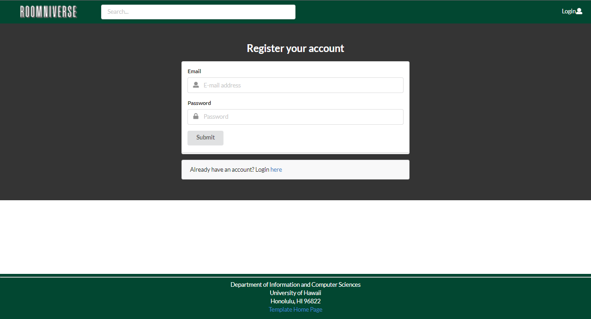
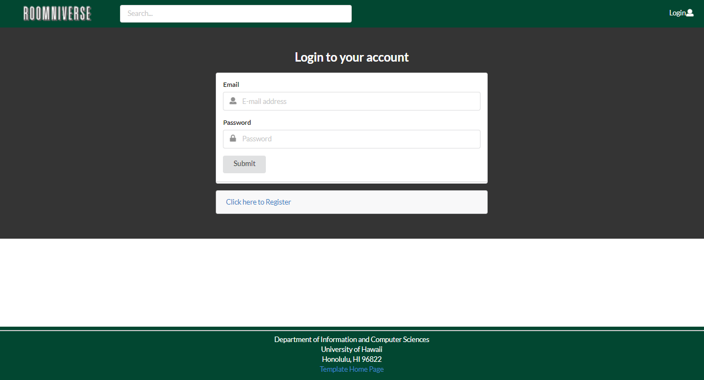
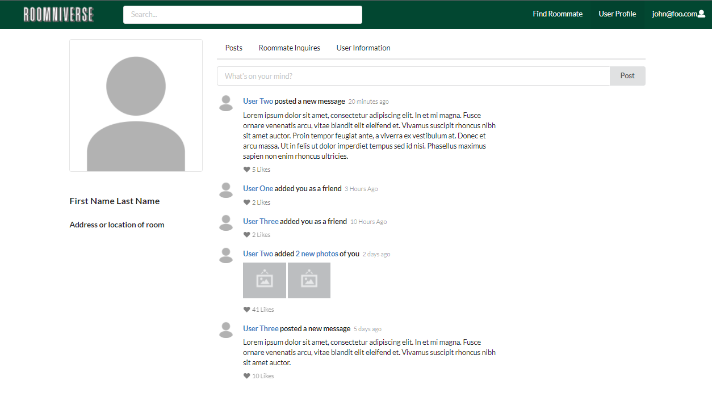
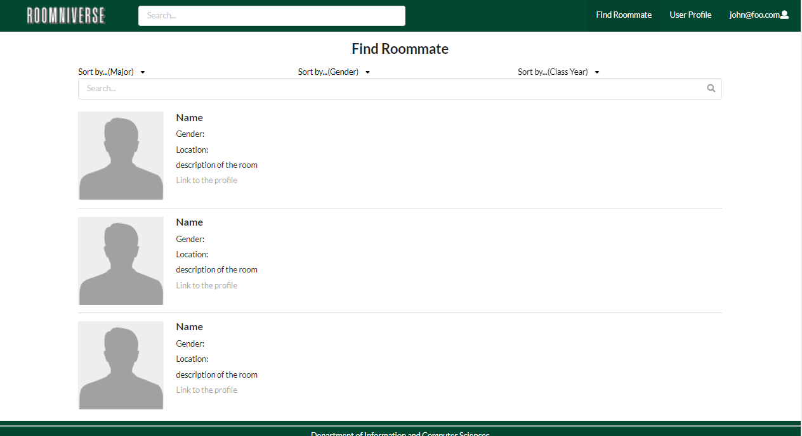

## Table of contents

* [Overview](#overview)
* [User Guide](#user-guide)
* [Deployment](#deployment)

## Overview
Roomniverse is a central hub where people in the UH Manoa dorms will be able to find and collaborate with new roommates. It illustrates various technologies useful to ICS software engineering students, including:

* [Meteor](https://www.meteor.com/) for Javascript-based implementation of client and server code.
* [React](https://reactjs.org/) for component-based UI implementation and routing.
* [Semantic UI React](https://react.semantic-ui.com/) CSS Framework for UI design.
* [Uniforms](https://uniforms.tools/) for React and Semantic UI-based form design and display.

## User Guide
This section provides a walkthrough of the Roomniverse user interface and its capabilities.

### Landing Page

* The landing page is presented to users when they visit the top-level URL to the site, explaining the features of Roomniverse.

### Sign-up/Log-in Page
Roomniverse provides an option to create an account to become part of the Roomniverse community.

Once registered, users can log into Roomniverse through log-in page, which grants the users to access the key features of Roomniverse.

### Main Hub
Once logged in, users will be greeted with main hub page, where users can interact with other users by creating a post to share about themselves to others.

* Roommate's posts
    * Post feed
        * Write comments
        * Leave a like/comment

### NavBar

* Access user profile
* Other links (Home, "Find Roommate")

### Footer

* Terms/Privacy
* About
* Webapp settings

### User Profile Page

User profile page presents features of:
* User's posts
* Edit user settings

### Admin Page
* List of posts

### Find Roommates Page

Find Roommates Page allows the user to explore and find about other Roomniverse users through search bars + advanced sorting feature. 
* Filter roommates based on keyboard input
* On click, it should link to the chosen rommate's profile & post

## Deployment
Here is a [link](http://137.184.234.250/) to our current website.
