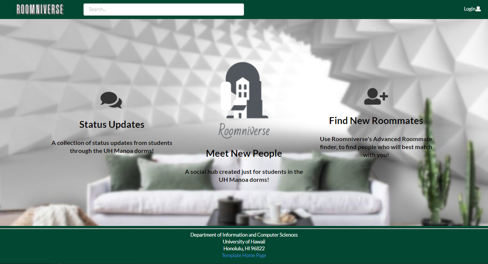
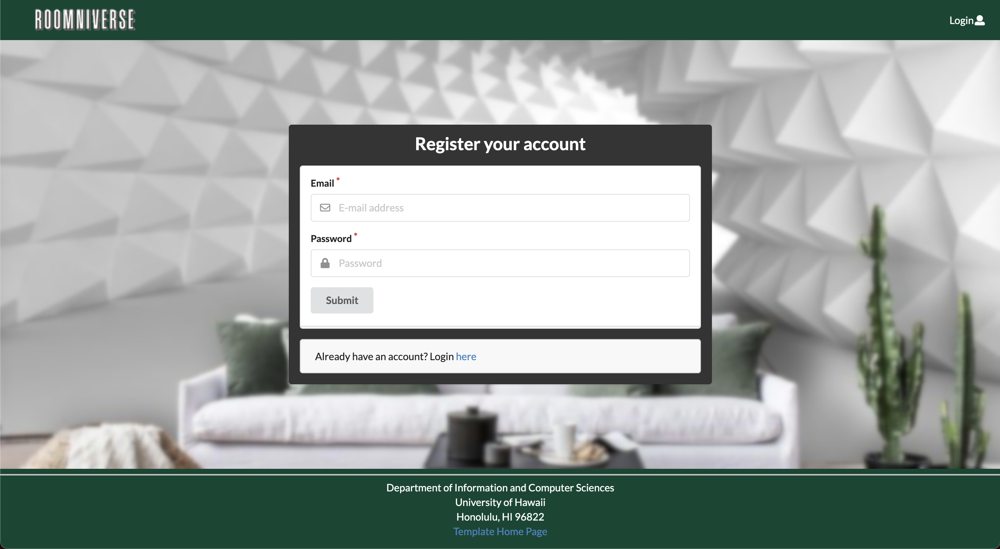
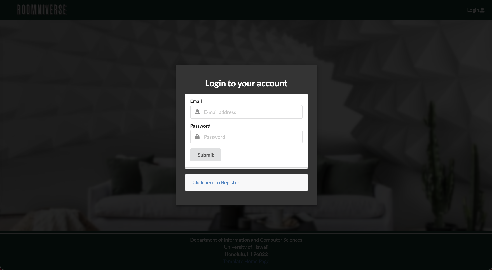
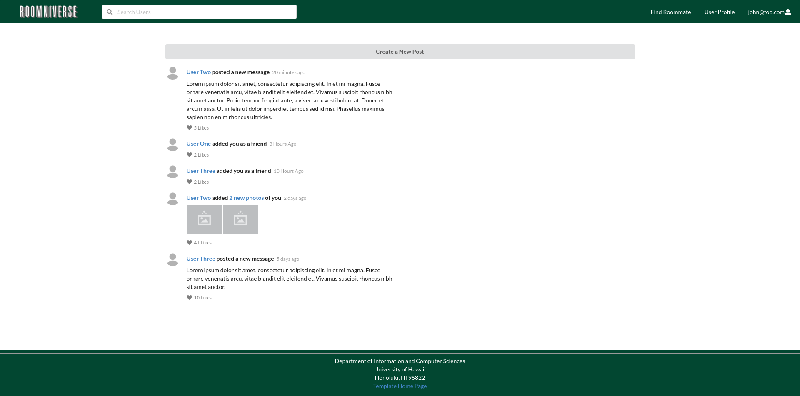
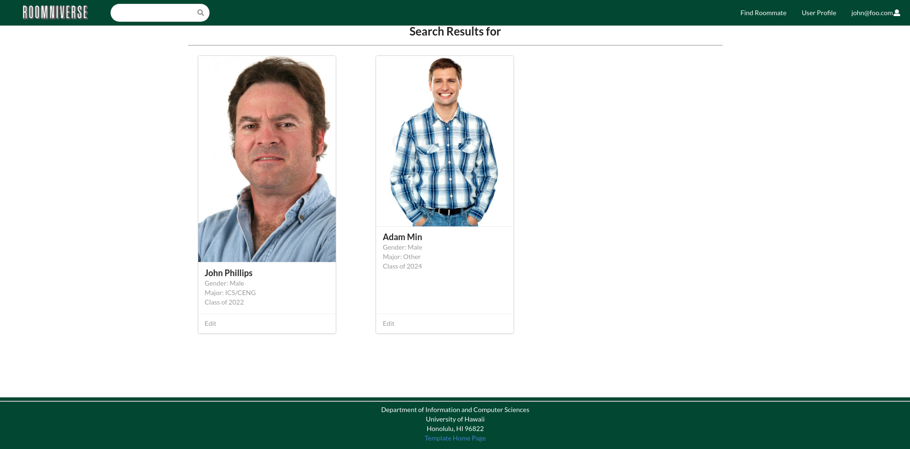
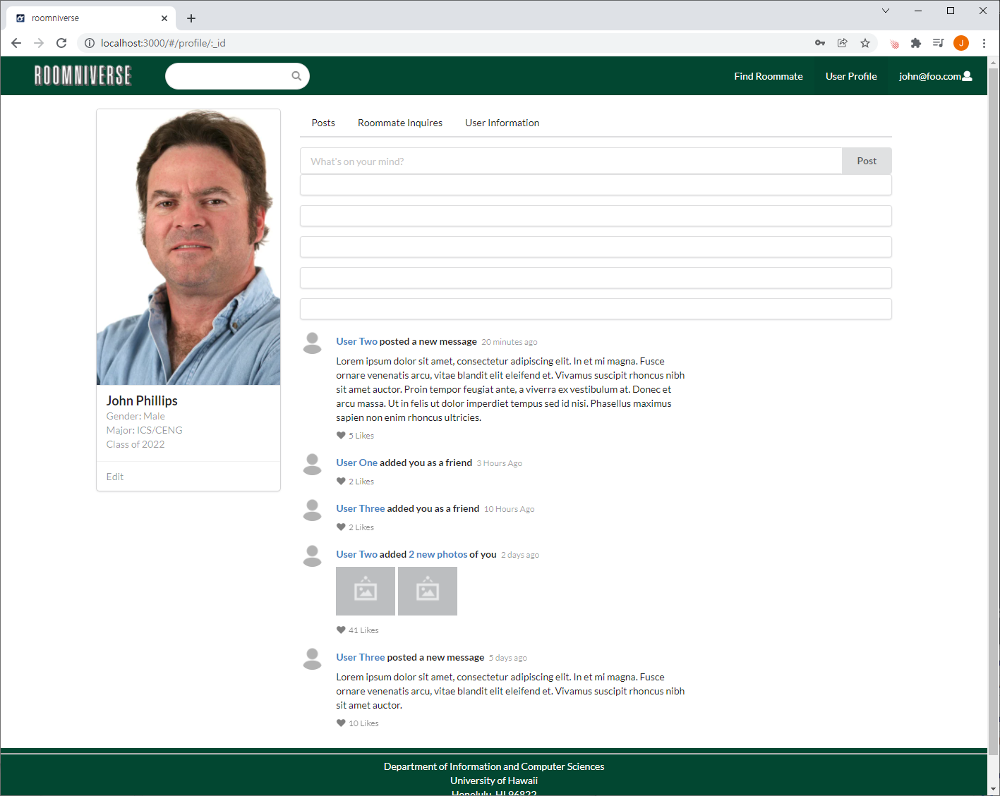
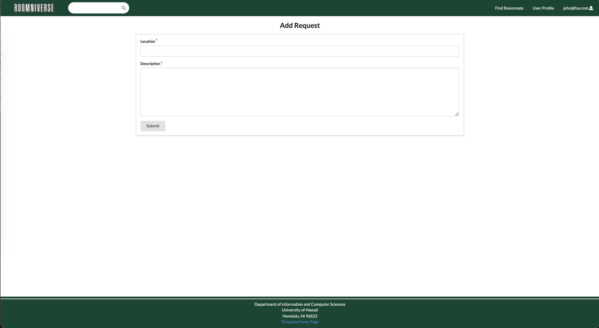
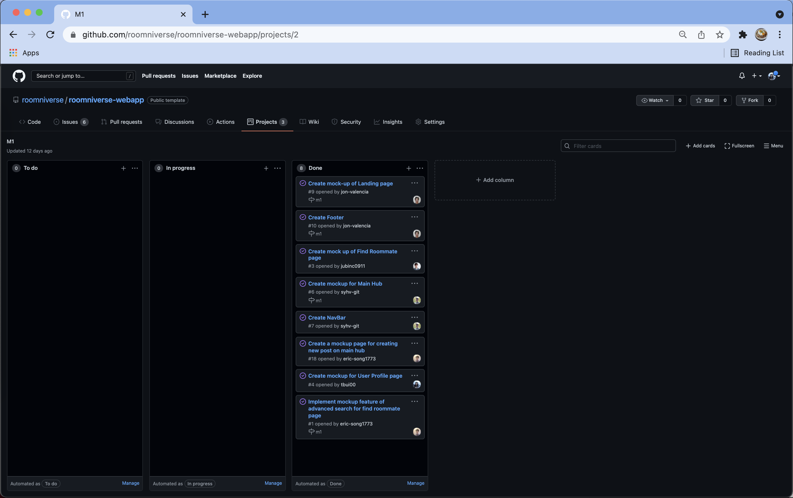
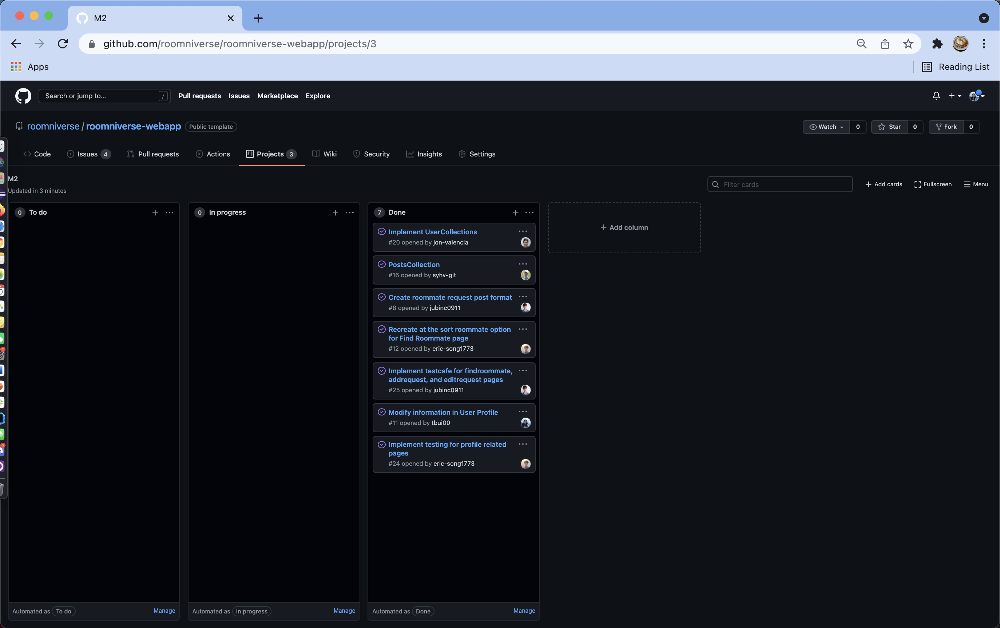
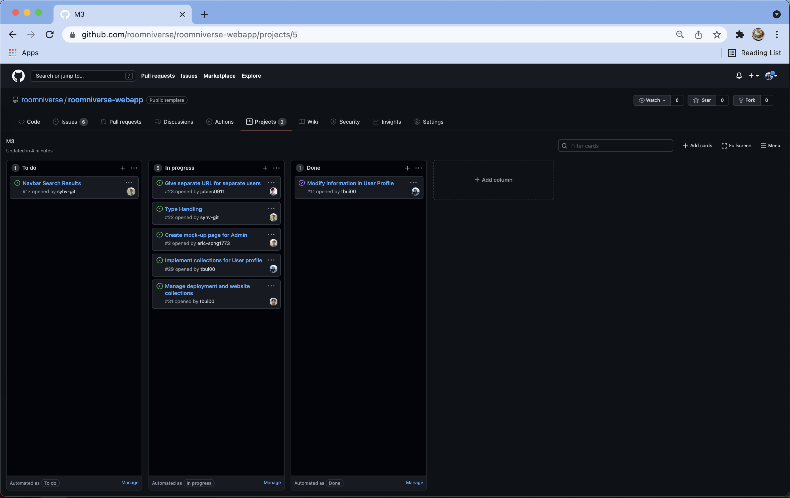

## Table of contents

* [Overview](#overview)
* [User Guide](#user-guide)
* [Deployment](#deployment)
* [Developer Guide](#developer-guide)
* [Continuous Integration](#continuous-integration)

## Overview
Roomniverse is a central hub where people in the UH Manoa dorms will be able to find and collaborate with new roommates. It illustrates various technologies useful to ICS software engineering students, including:

* [Meteor](https://www.meteor.com/) for Javascript-based implementation of client and server code.
* [React](https://reactjs.org/) for component-based UI implementation and routing.
* [Semantic UI React](https://react.semantic-ui.com/) CSS Framework for UI design.
* [Uniforms](https://uniforms.tools/) for React and Semantic UI-based form design and display.

## User Guide
This section provides a walkthrough of the Roomniverse user interface and its capabilities.

### Landing Page

* The landing page is presented to users when they visit the top-level URL to the site, explaining the features of Roomniverse.

### Sign-up/Log-in Page
Roomniverse provides an option to create an account to become part of the Roomniverse community.


Once registered, users can log into Roomniverse through log-in page, which grants the users to access the key features of Roomniverse.


### Main Hub
Once logged in, users will be greeted with main hub page, where users can interact with other users by creating a post to share about themselves to others.

* Roommate's posts
    * Post feed
        * Write comments
        * Leave a like/comment

### Create a New Post

User has the option to create and submit a new post into the main hub.

### NavBar

* Access user profile
* Other links (Home, "Find Roommate")
* Search for users
* Sign in/up/out

### Search Results Page

Search results filtered based on the user's search request. This page is accessible by pressing the enter key when the search bar is active and contains text.

### Footer

* Terms/Privacy
* About
* Webapp settings

### User Profile Page

User profile page presents features of:
* User's posts
* Edit user settings

### Admin Page
* List of posts

### Find Roommates Page

Find Roommates Page allows the user to explore and find about other Roomniverse users through search bars + advanced sorting feature. 
* Filter roommates based on keyboard input
* On click, it should link to the chosen rommate's profile & post

### Add Request Page

Add  Request Page allows the user to add a request of what they are looking for in a roommate. They are able to specify the location they are looking for any further details in the description of what are their wants and needs.

## Developer Guide
This guide will provide information to Meteor developers that would like to use this code as a basis for their own development.

### Installation
1. [Install Meteor](https://www.meteor.com/install). 

2. Visit the [Roomniverse application GitHub page](https://github.com/roomniverse/roomniverse-webapp) and click on the "Use this template" button to create your own repository that contains a copy of the Roomiverse application. Another route you can do is to download the sources as a zip file or make a fork of the repository. All of these different methods will download a copy of the repo to your local computer. 

3. Go into directory or `cd` into the roomiverse-webapp/app directory and install the libraries with the following commands below:

```
$ meteor npm install
```

4. Run the system with this command:

```
$ meteor npm run start
```

If the system started up properly with no issues, the application will be accessible through [http://localhost:3000](http://localhost:3000).

### Application Design
Roomiverse was created using the basis template [meteor-application-template-react](https://ics-software-engineering.github.io/meteor-application-template-react/) and [meteor-example-form-react](https://ics-software-engineering.github.io/meteor-example-form-react/). For further information about basic application deisgn and processing with in the Roomiverse application, feel free to refer to the video guides and docuementations from these sites.


### Initialization
The config directory holds the setting files for this application. This repository contains one file [config/settings.development.json](https://github.com/roomniverse/roomniverse-webapp/blob/master/config/settings.development.json).

This file contains the default data for the collections Posts, Requests, and Users as well as the relationship between these colelctions.

### Quality Assurance

#### ESLint

Roomniverse includes a file [.eslintrc](https://github.com/roomiverse/roomniverse-webapp/blob/master/app/.eslintrc) which defines the coding style that is used in the application.

To envoke the ESLint from the command line: 

```
meteor npm run lint
```

To ensure that there are no ESLint errors, the output should look like:

```
$ meteor npm run lint

> roomniverse-webapp@ lint /Users/sampleuser/github/roomniverse/roomniverse-webapp/app
> eslint --quiet --ext .jsx --ext .js ./imports ./tests

$
```
This result indicates that ESLint was able to run without generating any errors. 

## Deployment
Here is a [link](http://137.184.234.250/) to our current website.

## Continuous Integration
This section will go over the integrations that have been made through the application. 

### Milestone 1: Mockup development
The goal of Milestone 1 was to create HTML pages that were a mock up of what the pages will look like in the application. 

Milestone 1 was managed using [Roomniverse GitHub Project Board M1](https://github.com/roomniverse/roomniverse-webapp/projects/2):



### Milestone 2: Data model development
The goal of Milestone 2 was to implement the data models to function within the application. The data model is the set of Mongo Colelctions created and utilize the operations that manipulate the collections supporting the Roomniverse application.

Milestone 2 was managed using [Roomniverse GitHub Project Board M2](https://github.com/roomniverse/roomniverse-webapp/projects/3):



### Milestone 3: Final touch ups
The goal of Milestone 3 was to clean up the files of the directories, touch up on user interface features, and ensure everything is working smoothly. 

Milestone 3 was managed using [Roomniverse GitHub Project Board M3](https://github.com/roomniverse/roomniverse-webapp/projects/5):


