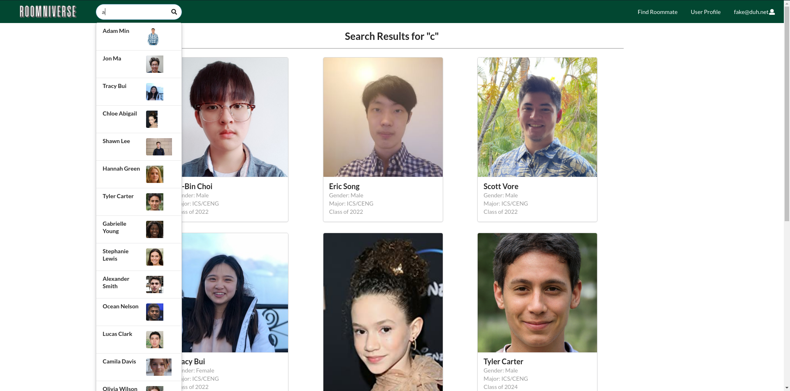
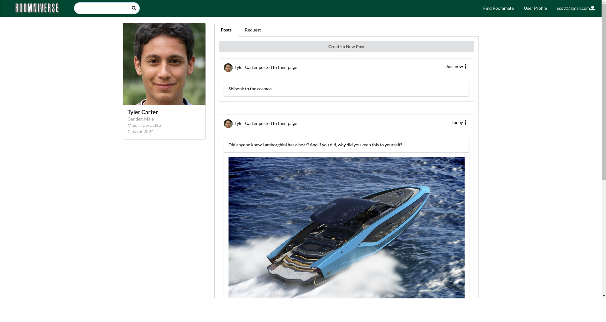
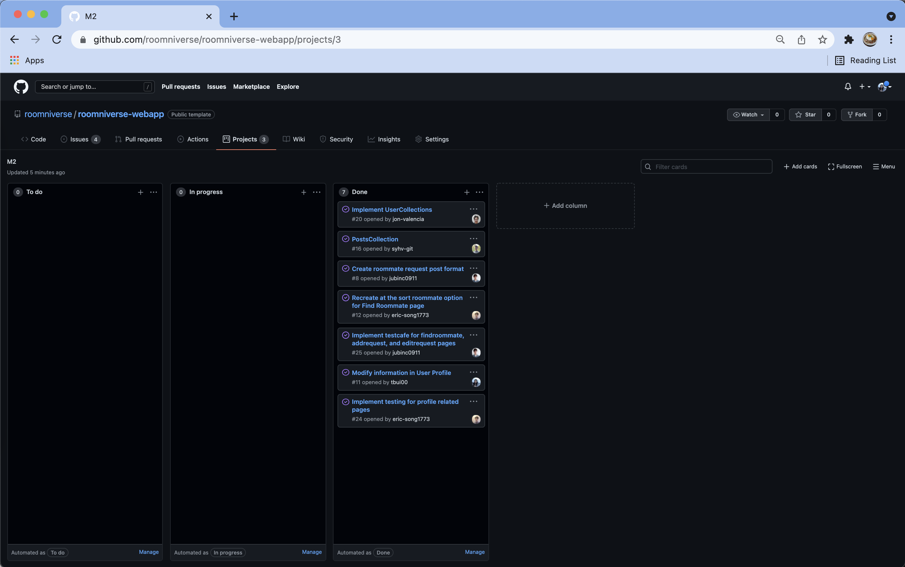
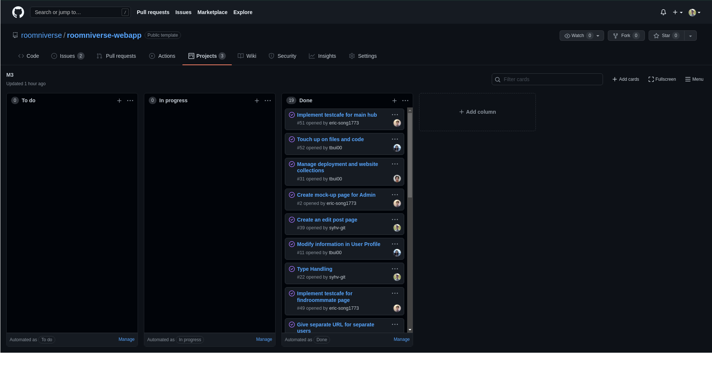

## Table of contents

* [Overview](#overview)
* [User Guide](#user-guide)
* [Deployment](#deployment)
* [Developer Guide](#developer-guide)
* [Continuous Integration](#continuous-integration)

## Overview
Roomniverse is a central hub where people in the UH Manoa dorms will be able to find and collaborate with new roommates. It illustrates various technologies useful to ICS software engineering students, including:

* [Meteor](https://www.meteor.com/) for Javascript-based implementation of client and server code.
* [React](https://reactjs.org/) for component-based UI implementation and routing.
* [Semantic UI React](https://react.semantic-ui.com/) CSS Framework for UI design.
* [Uniforms](https://uniforms.tools/) for React and Semantic UI-based form design and display.

## User Guide
This section provides a walkthrough of the Roomniverse user interface and its capabilities.

### Landing Page

* The landing page is presented to users when they visit the top-level URL to the site, explaining the features of Roomniverse.

### Sign-up Page

Roomniverse provides an option to create an account to become part of the Roomniverse community.

### Create Profile

After creating a new account, the user will be redirected to the Create Profile page where more information is inputted for the user profile.

### Sign-in Page

Once registered, users can log into Roomniverse through log-in page, which grants the users to access the key features of Roomniverse.

### Sign-out Page

When you are ready to log out of your session, you will see this page. To log out, go to the Nav Bar in the top right corner where your current session is displayed, click on the button, and sign out.

### Main Hub
Once logged in, users will be greeted with main hub page, where users can interact with other users by creating a post to share about themselves to others.

* Roommate's posts
    * Post feed
        * Write comments
        * Leave a like/comment

### Create a New Post

User has the option to create and submit a new post into the main hub.

### NavBar

* Access user profile
* Other links (Home, "Find Roommate")
* Search for users
* Sign in/up/out

### Search Results Page

The search bar dynamically filters user inqueres. You can click on a user's profile directly from the drop down to go to their profile page, or press enter to display all results matching the query sent.

### Footer

* Terms/Privacy
* About
* Webapp settings

### User Profile Page

The User Profile Page allows the current user to see their post history and roommate request history. The User Profile Page also shows the current user's profile data and provides them with a link to edit their profile.

### Edit Profile Page

The Edit Profile Page is accessible through the User Profile Page or most other places you find User Cards. Here the user can edit the details provided during the sign-up process.

### Admin Page

Users with the Admin role can access all the posts, requests, and users to moderate the webservice. The admin has full authorization to remove or edit user posts so this role should remain confidential and mitigate potential abuse vectors

### Find Roommates Page

Find Roommates Page allows the user to explore and find about other Roomniverse users through search bars + advanced sorting feature. 
* Filter roommates based on keyboard input
* On click, it should link to the chosen rommate's profile & post

### Add Request Page

Add  Request Page allows the user to add a request of what they are looking for in a roommate. They are able to specify the location they are looking for any further details in the description of what are their wants and needs.

## Note for Security
I (Scott Vore) am studying for a degree in Security Science and performed a basic level vulnerability analysis on the Roomniverse Webapplication while studying in ICS 426. The course introduces Certified Ethical Hacker techniques and tools to harden system and network security. I used Nikto, which is an open-source tool for scanning vulnerabilities present in webservers and services they provide. It was a fun, quick process where I learned the application is vulnerable to X-Frames attacks, and BREACH (Browser Reconnaissance and Exfiltration via Adaptive Compression of Hypertext) attacks when I first performed the test. X-Frames can be remediated when setting up the server setting for the webservice. Specifying that X-Frames are denied or only authorized for sameorigin usages is the best way to defend against this exploit. BREACH attacks are more complex and exploits http compression to advance access to information and remote systems. This is harder to resolve because HTTP compression happens on the server-side. HTTP compression is used to speed up network traffic, which results in decreased security.

## Developer Guide
This guide will provide information to Meteor developers that would like to use this code as a basis for their own development.

### Installation
1. [Install Meteor](https://www.meteor.com/install). 

2. Visit the [Roomniverse application GitHub page](https://github.com/roomniverse/roomniverse-webapp) and click on the "Use this template" button to create your own repository that contains a copy of the Roomiverse application. Another route you can do is to download the sources as a zip file or make a fork of the repository. All of these different methods will download a copy of the repo to your local computer. 

3. Go into directory or `cd` into the roomiverse-webapp/app directory and install the libraries with the following commands below:

```
$ meteor npm install
```

4. Run the system with this command:

```
$ meteor npm run start
```

If the system started up properly with no issues, the application will be accessible through [http://localhost:3000](http://localhost:3000).

### Application Design
Roomiverse was created using the basis template [meteor-application-template-react](https://ics-software-engineering.github.io/meteor-application-template-react/) and [meteor-example-form-react](https://ics-software-engineering.github.io/meteor-example-form-react/). For further information about basic application deisgn and processing with in the Roomiverse application, feel free to refer to the video guides and docuementations from these sites.


### Initialization
The config directory holds the setting files for this application. This repository contains one file [config/settings.development.json](https://github.com/roomniverse/roomniverse-webapp/blob/master/config/settings.development.json).

This file contains the default data for the collections Posts, Requests, and Users as well as the relationship between these colelctions.

### Quality Assurance

#### ESLint

Roomniverse includes a file [.eslintrc](https://github.com/roomiverse/roomniverse-webapp/blob/master/app/.eslintrc) which defines the coding style that is used in the application.

To envoke the ESLint from the command line: 

```
meteor npm run lint
```

To ensure that there are no ESLint errors, the output should look like:

```
$ meteor npm run lint

> roomniverse-webapp@ lint /Users/sampleuser/github/roomniverse/roomniverse-webapp/app
> eslint --quiet --ext .jsx --ext .js ./imports ./tests

$
```
This result indicates that ESLint was able to run without generating any errors. 

## Community Feedback
After our final deployment we surveyed members of the UH community to get feed back on Roomniverse. We asked them to list one thing they liked and one thing they thought could be improved.

### Feedback #1
**1 thing I liked about Roomniverse:**

Using roomniverse felt very similar to using social media platform I used previously such as Facebook, giving
initial user friendly experience.

**1 thing I think the team could have improved about Roomniverse:**

I think the roomniverse team could have made an improvement of adding more features on post, such as the likes
and comments.

### Feedback #2
**1 thing I liked about Roomniverse:**

The find roommate section was straightfoward, along with the convenient sort tabs provided to filter requests.

**1 thing I think the team could have improved about Roomniverse:**

I wish the sort tabs had more functionality. "Sort by major" tab could have had more major selections, rather than
"ICS/CENG" and "Others".

### Feedback #3
**1 thing I liked about Roomniverse:**
I like how organized everything is and how simple it is to navigate the links and see what specifications each person wants in a roommate.

**1 thing I think the team could have improved about Roomniverse:**

Maybe a messaging feature? To message the person you are interested in rooming with?

### Feedback #4
**1 thing I liked about Roomniverse:**

The search/filter function makes it easier to find roommates.

**1 thing I think the team could have improved about Roomniverse:**

Maybe have a way to search/filter the posts on the main page. I'm not sure what the "add request" button is for, as it is not intuitive

### Feedback #5
**1 thing I liked about Roomniverse:**

It's very simple and straightforward in its intent. Concept is to look for potential roommates. Roomniverse creates a space for others to find preferences in who they want as a roommate (e.g. if they share the same major or graduation year)

**1 thing I think the team could have improved about Roomniverse:**

The main page where all the posts are located felt less intuitive. On the "Find Roommate" page, the separators and filters makes it easy to understand what this page's purpose is. The main page is what I'm assuming to be a current feed page (not entirely sure though because it has activity that's related to me as a user, but also activity of others completely irrelevant to me)

### Our Response
We are very happy with the community's response to Roomniverse. It's apparent that there are people that enjoy our application and care about it enough to suggest changes and improvements! Some of, if not all of the suggestions were things that we just didn't think about during the development process and we're happy that it's being pointed out to us. In the future we will look to implement these improvements so that Roomniverse can reach its full potential.

## Deployment
Here is a [link](https://roomniverse.xyz) to our current website.

## Continuous Integration
This section will go over the integrations that have been made through the application. 

### Milestone 1: Mockup development
The goal of Milestone 1 was to create HTML pages that were a mock up of what the pages will look like in the application. 

Milestone 1 was managed using [Roomniverse GitHub Project Board M1](https://github.com/roomniverse/roomniverse-webapp/projects/2):


### Milestone 2: Data model development
The goal of Milestone 2 was to implement the data models to function within the application. The data model is the set of Mongo Colelctions created and utilize the operations that manipulate the collections supporting the Roomniverse application.

Milestone 2 was managed using [Roomniverse GitHub Project Board M2](https://github.com/roomniverse/roomniverse-webapp/projects/3):



### Milestone 3: Final touch ups
The goal of Milestone 3 was to clean up the files of the directories, touch up on user interface features, and ensure everything is working smoothly. 

Milestone 3 was managed using [Roomniverse GitHub Project Board M3](https://github.com/roomniverse/roomniverse-webapp/projects/5):


